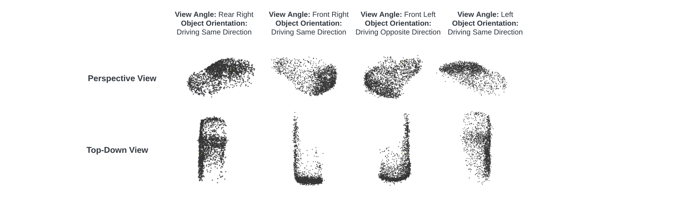

**Final Project for CS886: Diffusion Model**

This project explores enhancing autonomous driving simulations by generating realistic LiDAR point clouds using probabilistic diffusion models. The primary focus is on simulating the point clouds for individual objects such as cars, pedestrians, and bicycles with specific orientations and view angles relative to a hypothetical sensor. This targeted approach allows for more accurate and controlled simulations, which are crucial for the development and testing of autonomous vehicles' sensory systems.

